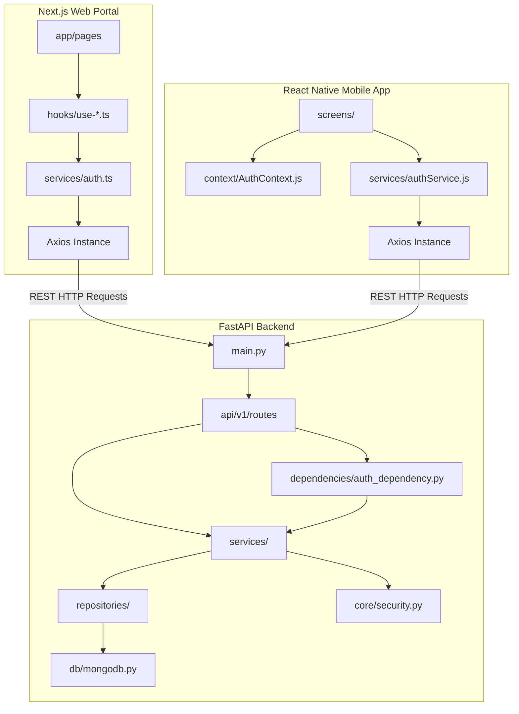

# Dependency Graph Report

This document displays a visual graph of module-to-module dependencies.

```mermaid
graph TD
    subgraph FastAPIBackend [FastAPI Backend]
        main.py --> Routes[api/v1/routes]
        Routes --> Services[services/]
        Services --> Repositories[repositories/]
        Repositories --> Database[db/mongodb.py]
        Services --> Security[core/security.py]
        Routes --> Dependencies[dependencies/auth_dependency.py]
        Dependencies --> Services
    end

    subgraph NextJSWeb [Next.js Web Portal]
        AppPages[app/pages] --> WebHooks[hooks/use-*.ts]
        WebHooks --> WebServices[services/auth.ts]
        WebServices --> AxiosWeb[Axios Instance]
    end

    subgraph ReactMobile [React Native Mobile App]
        Screens[screens/] --> MobContext[context/AuthContext.js]
        Screens --> MobServices[services/authService.js]
        MobServices --> AxiosMob[Axios Instance]
    end

    AxiosWeb -->|REST HTTP Requests| main.py
    AxiosMob -->|REST HTTP Requests| main.py
```
