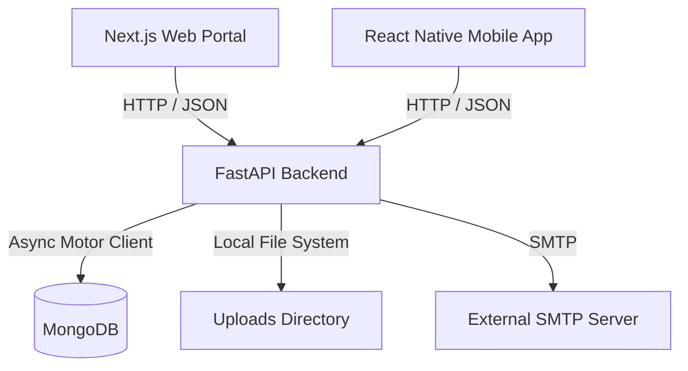

# Civifix Project Architecture

Civifix is a modern citizen-to-government (C2G) engagement platform focused on complaint management in Tamil Nadu, India. It enables citizens to register, log complaints, and track their resolution, while providing administrative roles (Super Admin, District Admin, Inspector, Worker) with tools to verify, assign, and resolve these issues.

## High-Level System Architecture

The platform follows a decoupled, three-tier service-oriented architecture:

1.  **Presentation Layer (Frontends)**:
    *   **Next.js Web Portal (`civifix-web`)**: A high-performance web application built with React 19 and Next.js 15 App Router. It serves as the portal for administrators, inspectors, and citizens on desktop/tablet devices.
    *   **React Native Mobile App (`civifix-frontend`)**: A cross-platform mobile application powered by Expo and NativeWind (Tailwind CSS) primarily optimized for citizens and on-the-field workers.
2.  **Application Layer (Backend API)**:
    *   **FastAPI Backend (`Backend`)**: A high-performance, asynchronous RESTful API built with Python 3.12 and FastAPI. It exposes JSON endpoints, runs background workers, manages validation, and handles JWT/OTP authentication.
3.  **Data Layer (Database & Storage)**:
    *   **MongoDB**: A NoSQL document database used via the asynchronous `motor` driver.
    *   **File Storage**: Local uploads directory (`/uploads`) for managing complaint media and attachments.

---

## Backend Clean Architecture

The backend follows the clean architecture pattern, isolating concerns into separate layers:

*   **API Routes (`app/api/v1/`)**: Exposes REST endpoints, defines query/path parameters, and routes requests to Services.
*   **Services (`app/services/`)**: Implements business rules (e.g., spam checks, assignment rules, verification logic).
*   **Repositories (`app/repositories/`)**: Abstracts database queries and mutations, providing a clean interface to the data store.
*   **Models (`app/models/`)**: Defines the data schema structures stored in MongoDB.
*   **Schemas (`app/schemas/`)**: Pydantic input validation models and response models.
*   **Core (`app/core/`)**: Cross-cutting concerns such as application configurations, security utilities, custom exception classes, and logging.
*   **Dependencies (`app/dependencies/`)**: FastAPI dependencies for token extraction, user state loading, and RBAC authorization.

---

## Frontend Web Architecture

The Next.js application (`civifix-web`) utilizes:
*   **Next.js 15 App Router**: Page-based routing with file system layout structures.
*   **TanStack React Query**: Server state caching, background refetching, and synchronization.
*   **Axios HTTP Client**: Centralized requests with auth headers and global interceptors.
*   **Tailwind CSS 4**: Core design system and layout styling.

---

## Mobile App Architecture

The React Native application (`civifix-frontend`) utilizes:
*   **React Navigation**: Nested stack and bottom tab navigators.
*   **AuthContext**: React Context API for global session and token persistence.
*   **AsyncStorage**: Secure local device storage for JWT.
*   **NativeWind**: Utility-first styling for mobile layouts.
