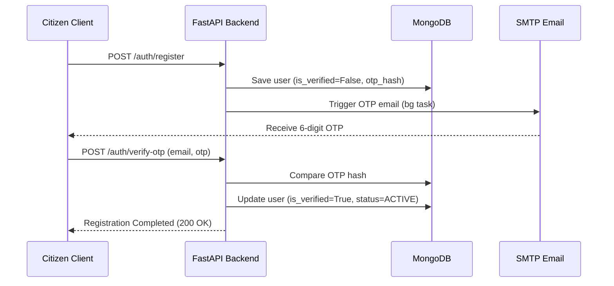

# Authentication & Authorization Documentation

Civifix implements a secure, robust authentication and Role-Based Access Control (RBAC) authorization workflow.

## 1. Authentication Flow

### Register Flow (OTP Verification)
1.  **Submit Registration**: Citizen submits registration details (name, email, mobile, address, district, constituency).
2.  **Generate OTP**: The system generates a cryptographically random 6-digit OTP, hashes it using bcrypt, and saves it in the user's document (`otp_code_hash`, `otp_expiry`).
3.  **Send Email**: The OTP is emailed to the citizen in a background task. The user record is created with `is_verified=False` and status `INACTIVE`.
4.  **Verification**: Citizen submits the OTP via `/auth/verify-otp`.
5.  **Activation**: The backend verifies the OTP hash and sets `is_verified=True`, `is_active=True`, and status `ACTIVE`.

### Login Flow (OTP Verification)
1.  **Request OTP**: Citizen submits their email via `/auth/login`.
2.  **OTP Generation**: If the user exists, a login OTP is generated, hashed, saved, and sent via email.
3.  **Submit OTP**: User submits the OTP to `/auth/verify-login-otp`.
4.  **JWT Response**: If valid, the server returns an Access Token and a Refresh Token.

---

## 2. JWT Mechanics
*   **Access Token**: Expires in **15 minutes**. Used to authenticate subsequent requests in the `Authorization: Bearer <token>` header. Contains `sub` (user email), `role`, and `district`.
*   **Refresh Token**: Expires in **7 days**. Used to request new Access Tokens via `/auth/refresh-token` without prompt.
*   **Algorithm**: `HS256` HMAC with SHA-256.

---

## 3. Role-Based Access Control (RBAC)

The application enforces fine-grained route security based on roles. The roles are:

| Role | Access Level | Description |
| :--- | :--- | :--- |
| **SUPER_ADMIN** | Global system access | Manage all districts, constituencies, roles, and platform settings. |
| **DISTRICT_ADMIN**| District isolated access | Create inspectors/workers for their district, view all complaints in their district. |
| **INSPECTOR** | Ward isolated access | View assigned complaints, approve/reject complaints, assign workers to complaints. |
| **WORKER** | Task isolated access | View assigned tasks, update status, report progress. |
| **CITIZEN** | Owner isolated access | Raise complaints, track progress of own complaints, submit feedback. |

### District Isolation
District Admins, Inspectors, and Workers are isolated to their registered `district`. The `district_dependency.py` verification layer ensures that a District Admin or Inspector cannot view, modify, or assign complaints or wards belonging to another district.
