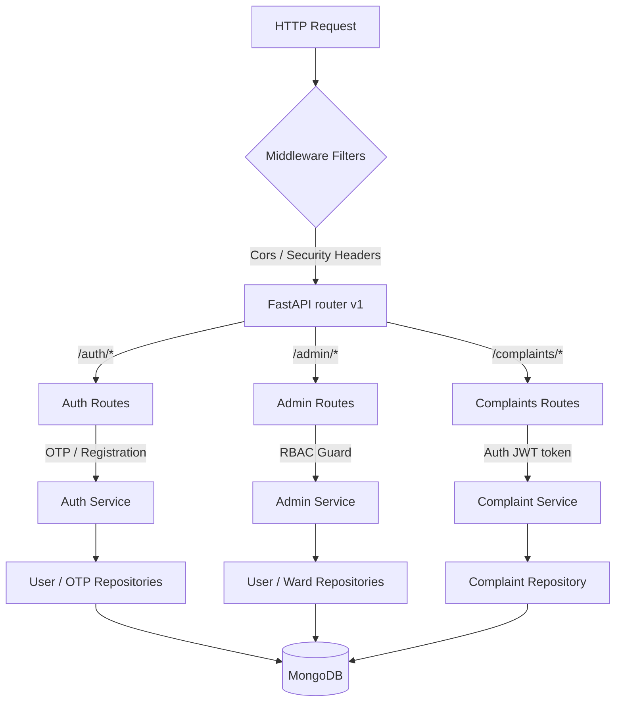

# API Flow Diagram

This diagram displays the execution path of incoming API requests through the backend system.

```mermaid
graph TD
    Request[HTTP Request] --> Middleware{Middleware Filters}
    
    Middleware -->|Cors / Security Headers| Router[FastAPI router v1]
    
    Router -->|/auth/*| AuthController[Auth Routes]
    Router -->|/admin/*| AdminController[Admin Routes]
    Router -->|/complaints/*| ComplaintController[Complaints Routes]
    
    AuthController -->|OTP / Registration| AuthService[Auth Service]
    AdminController -->|RBAC Guard| AdminService[Admin Service]
    ComplaintController -->|Auth JWT token| ComplaintService[Complaint Service]
    
    AuthService --> AuthDB[User / OTP Repositories]
    AdminService --> AdminDB[User / Ward Repositories]
    ComplaintService --> ComplaintDB[Complaint Repository]
    
    AuthDB --> MongoDB[(MongoDB)]
    AdminDB --> MongoDB
    ComplaintDB --> MongoDB
```
