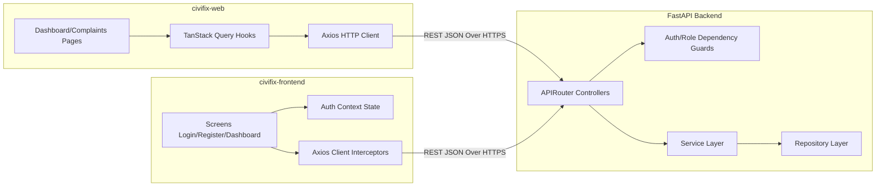

# Component Diagram

This diagram shows component relationships and data transfers between frontends and backend modules.

```mermaid
graph LR
    subgraph WebPortal [civifix-web]
        WPages[Dashboard/Complaints Pages] --> WQueries[TanStack Query Hooks]
        WQueries --> WServices[Axios HTTP Client]
    end

    subgraph MobileApp [civifix-frontend]
        MScreens[Screens Login/Register/Dashboard] --> MContext[Auth Context State]
        MScreens --> MServices[Axios Client Interceptors]
    end

    subgraph BackendAPI [FastAPI Backend]
        Router[APIRouter Controllers] --> AuthDep[Auth/Role Dependency Guards]
        Router --> BServices[Service Layer]
        BServices --> BRepos[Repository Layer]
    end

    WServices -->|REST JSON Over HTTPS| Router
    MServices -->|REST JSON Over HTTPS| Router
```
