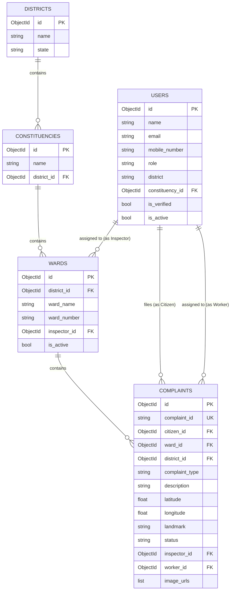

# Database ER Diagram

This entity-relationship diagram shows collections and their references/relations in MongoDB.

```mermaid
erDiagram
    DISTRICTS ||--o{ CONSTITUENCIES : "contains"
    CONSTITUENCIES ||--o{ WARDS : "contains"
    WARDS ||--o{ COMPLAINTS : "contains"
    USERS ||--o{ COMPLAINTS : "files (as Citizen)"
    USERS ||--o{ COMPLAINTS : "assigned to (as Worker)"
    USERS ||--o{ WARDS : "assigned to (as Inspector)"

    USERS {
        ObjectId id PK
        string name
        string email
        string mobile_number
        string role
        string district
        ObjectId constituency_id FK
        bool is_verified
        bool is_active
    }

    COMPLAINTS {
        ObjectId id PK
        string complaint_id UK
        ObjectId citizen_id FK
        ObjectId ward_id FK
        ObjectId district_id FK
        string complaint_type
        string description
        float latitude
        float longitude
        string landmark
        string status
        ObjectId inspector_id FK
        ObjectId worker_id FK
        list image_urls
    }

    WARDS {
        ObjectId id PK
        ObjectId district_id FK
        string ward_name
        string ward_number
        ObjectId inspector_id FK
        bool is_active
    }

    CONSTITUENCIES {
        ObjectId id PK
        string name
        ObjectId district_id FK
    }

    DISTRICTS {
        ObjectId id PK
        string name
        string state
    }
```
