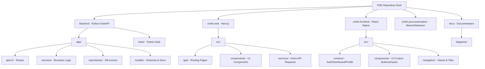

# Folder Tree Diagram

This diagram outlines the relative structure of the repository directories.

```mermaid
graph TD
    Root[PDD Repository Root]
    
    Root --> Backend[Backend - Python FastAPI]
    Root --> Web[civifix-web - Next.js]
    Root --> Mobile[civifix-frontend - React Native]
    Root --> Java[civifix-java-automation - Maven/Selenium]
    Root --> Docs[docs - Documentation]
    
    Backend --> BApp[app/]
    BApp --> BRoutes[api/v1/ - Routes]
    BApp --> BServices[services/ - Business Logic]
    BApp --> BRepo[repositories/ - DB Access]
    BApp --> BModels[models/ - Schemas & Docs]
    Backend --> BTests[tests/ - Pytest Suite]
    
    Web --> WSrc[src/]
    WSrc --> WApp[app/ - Routing Pages]
    WSrc --> WComp[components/ - UI Components]
    WSrc --> WServices[services/ - Axios API Requests]
    
    Mobile --> MSrc[src/]
    MSrc --> MScreens[screens/ - Auth/Dashboard/Profile]
    MSrc --> MComp[components/ - UI Custom Buttons/Inputs]
    MSrc --> MNav[navigation/ - Stacks & Tabs]
    
    Docs --> Diagrams[diagrams/]
```
