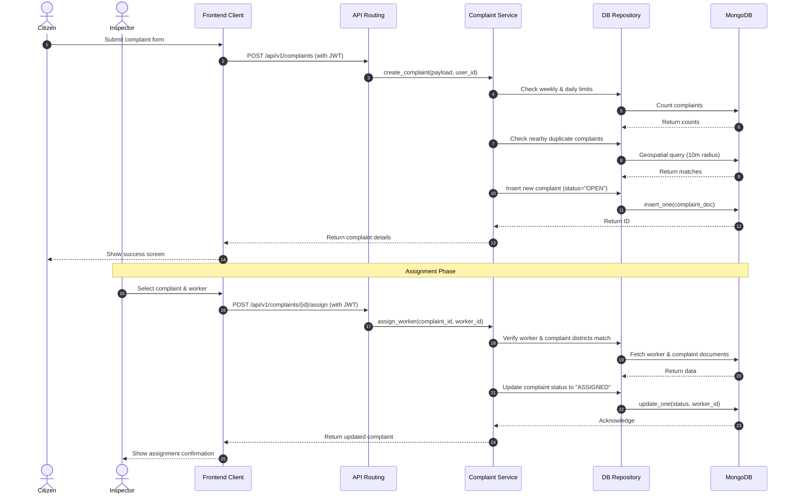

# Sequence Diagram

This sequence diagram displays the step-by-step lifecycle of raising and assigning a complaint.

```mermaid
sequenceDiagram
    autonumber
    actor Citizen
    actor Inspector
    participant Web/Mobile as Frontend Client
    participant Router as API Routing
    participant Service as Complaint Service
    participant Repo as DB Repository
    participant DB as MongoDB

    Citizen->>Web/Mobile: Submit complaint form
    Web/Mobile->>Router: POST /api/v1/complaints (with JWT)
    Router->>Service: create_complaint(payload, user_id)
    Service->>Repo: Check weekly & daily limits
    Repo->>DB: Count complaints
    DB-->>Repo: Return counts
    Service->>Repo: Check nearby duplicate complaints
    Repo->>DB: Geospatial query (10m radius)
    DB-->>Repo: Return matches
    Service->>Repo: Insert new complaint (status="OPEN")
    Repo->>DB: insert_one(complaint_doc)
    DB-->>Service: Return ID
    Service-->>Web/Mobile: Return complaint details
    Web/Mobile-->>Citizen: Show success screen

    Note over Inspector, DB: Assignment Phase
    Inspector->>Web/Mobile: Select complaint & worker
    Web/Mobile->>Router: POST /api/v1/complaints/{id}/assign (with JWT)
    Router->>Service: assign_worker(complaint_id, worker_id)
    Service->>Repo: Verify worker & complaint districts match
    Repo->>DB: Fetch worker & complaint documents
    DB-->>Repo: Return data
    Service->>Repo: Update complaint status to "ASSIGNED"
    Repo->>DB: update_one(status, worker_id)
    DB-->>Service: Acknowledge
    Service-->>Web/Mobile: Return updated complaint
    Web/Mobile-->>Inspector: Show assignment confirmation
```
