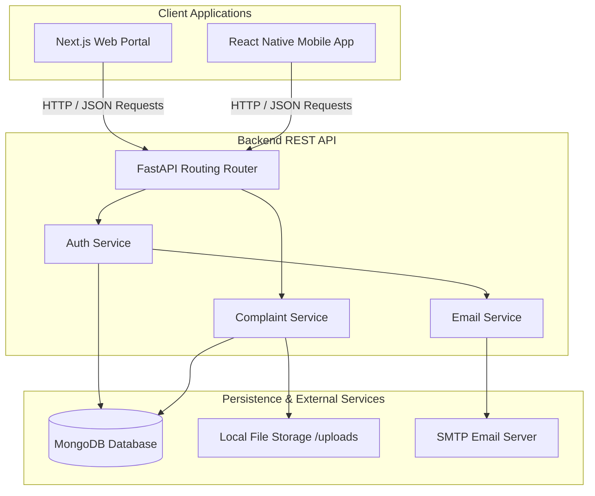

# System Architecture Diagram

This diagram displays the high-level deployment and data flow of the Civifix application.

```mermaid
graph TB
    subgraph Clients [Client Applications]
        Web[Next.js Web Portal]
        Mobile[React Native Mobile App]
    end

    subgraph Server [Backend REST API]
        Gateway[FastAPI Routing Router]
        AuthService[Auth Service]
        ComplaintService[Complaint Service]
        EmailService[Email Service]
    end

    subgraph DatabaseLayer [Persistence & External Services]
        MongoDB[(MongoDB Database)]
        Storage[Local File Storage /uploads]
        SMTP[SMTP Email Server]
    end

    Web -->|HTTP / JSON Requests| Gateway
    Mobile -->|HTTP / JSON Requests| Gateway
    
    Gateway --> AuthService
    Gateway --> ComplaintService
    
    AuthService --> MongoDB
    AuthService --> EmailService
    ComplaintService --> MongoDB
    ComplaintService --> Storage
    
    EmailService --> SMTP
```
